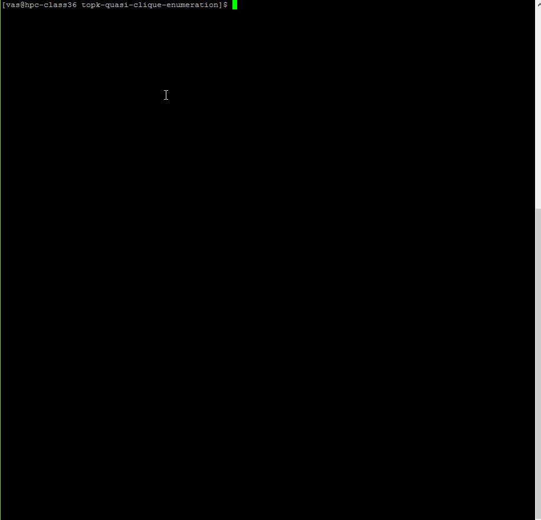

# Enumerating Top-k Quasi-Cliques
A heuristic method to enumerate top-k maximal quasi cliques.

### Abstract of our paper
  Quasi-cliques are dense incomplete subgraphs of a graph that generalize the notion of cliques. Enumerating quasi-cliques from a graph is a robust way to detect densely connected subgraphs, with applications to bio-informatics and social network analysis. However, enumerating quasi-cliques from a graph is a challenging problem, even harder than the problem of enumerating cliques. We consider enumerating top-k degree-based quasi-cliques: (1) We show that even the task of detecting if a given degree-based quasi-clique is maximal (i.e. not contained within another quasi-clique) is NP-hard (2) We present a novel heuristic algorithm kernelQC to enumerate the k largest quasi-cliques in a graph. Our method is based on identifying kernels of extremely dense subgraphs within a graph, following by growing subgraphs around these kernels, to arrive at quasi-cliques that satisfy required thresholds on degree (3) Experimental results show that our algorithm is accurate, often more than three orders of magnitude faster than the prior state-of-the-art methods, and scales to larger graphs than current methods.

You can find the longer version of this paper here: https://arxiv.org/pdf/1808.09531.pdf

# Source code

You may find the C++ implementation of our algorithm in the source folder. 

See how you can run the code.

  

If you have any question or difficulty to run the code please contact me at vas@iastate.edu.

_Disclaimer: This implementation is not the same as the implementation we used for our experiments. I changed the implementation to make it easier to understand and read for other researchers. In the original implementation, when the paremter gamma = 1, we use clique enumeration. For the sake of simplcity and convinience, we use quickM even if gamma = 1._
